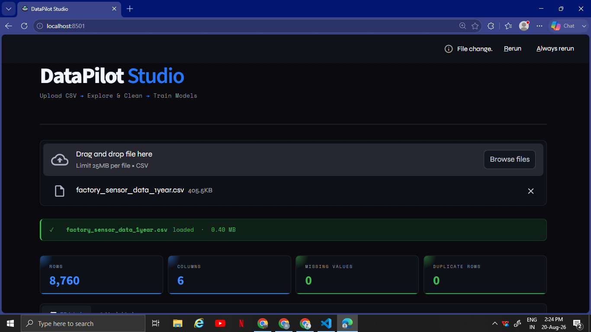

# DataPilot Studio

DataPilot Studio is an interactive web application built with Streamlit that helps users perform Exploratory Data Analysis (EDA) without writing code. Simply upload a CSV dataset and the application automatically generates insights, statistics, and visualizations to help you understand your data.

## Features:
- Upload CSV datasets (up to 100MB)
- Dataset overview (rows, columns, data types)
- Column-level analysis and statistics
- Missing value detection
- Correlation heatmap for numerical features
- Multiple data visualizations:
  - Histogram
  - Box Plot
  - Bar Chart
  - Scatter Plot
  - Line Chart
  - Violin Plot
  - Pie Chart
- Data cleaning tools:
  - Fill missing values (Mean / Median / Mode)
  - Remove duplicate rows
- Download generated charts
- Download cleaned dataset

## Tech Stack:
- Python
- Streamlit
- Pandas
- NumPy
- Matplotlib
- Seaborn

## Installation:

Clone the repository:
```bash
git clone https://github.com/krishna-srivastava/DataPilot-Studio.git
cd DataPilot-Studio
```

Install dependencies:
```bash
pip install -r requirements.txt
```

Run the application:
```bash
streamlit run app.py
```

## App Preview:


## How It Works:
1. Upload your dataset in CSV format.
2. Explore dataset overview and column statistics.
3. Generate visualizations and correlation insights.
4. Clean your data by handling missing values and removing duplicates.
5. Download charts or the cleaned dataset.

## Goal of the Project:
The goal of DataPilot Studio is to make data analysis simple and accessible for beginners who may not be comfortable writing Python code for data exploration.

## Author:
Krishna Srivastava
